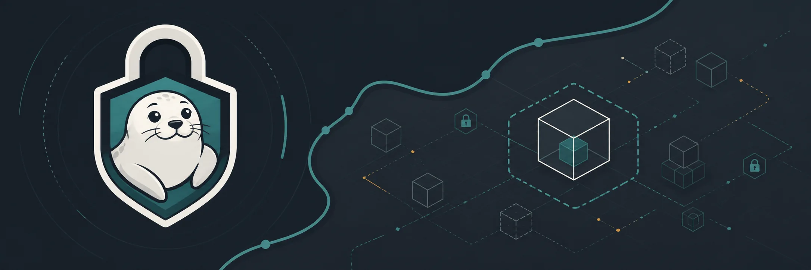

  

# RunSeal Labs

RunSeal Labs builds **RunSeal**, an OS-native local sandbox layer for AI agents.

RunSeal provides a stable execution protocol for running local commands inside policy-governed filesystem, process, resource, and network boundaries. It is local-first infrastructure for agent frameworks, not a cloud VM sandbox, Docker Desktop replacement, or microVM platform.

## Repositories

- [runseal](https://github.com/runseal-labs/runseal) - public Rust implementation.
- [rfcs](https://github.com/runseal-labs/rfcs) - public protocol and policy contract.

## Status

RunSeal is in technical preview. Windows is the MVP reference backend; macOS and Linux are experimental or future backend targets until conformance evidence promotes specific capabilities.
